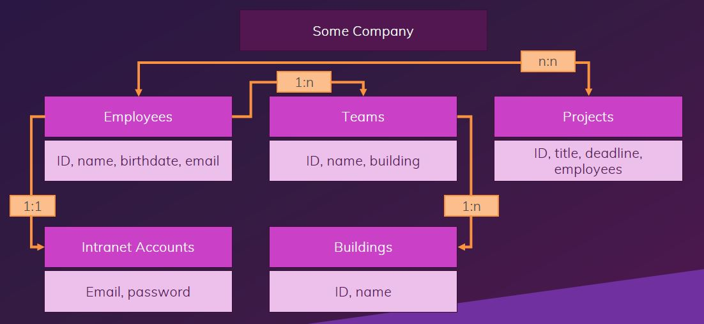
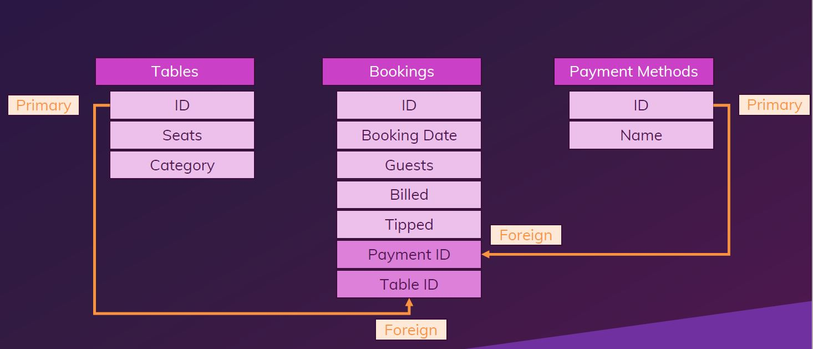
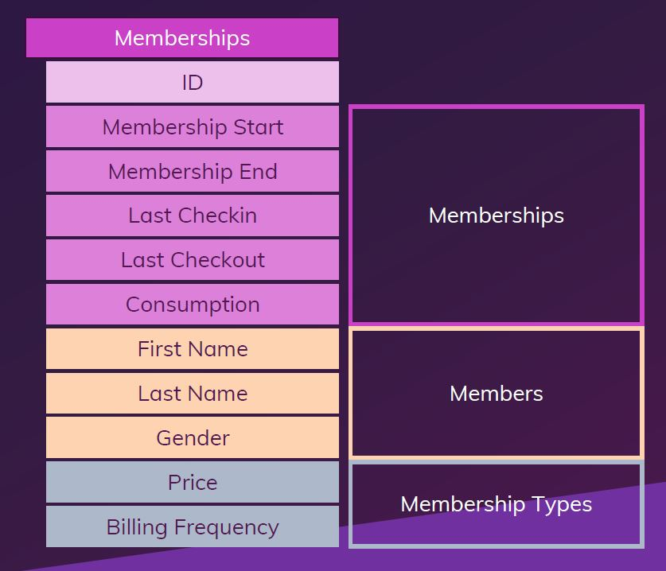

In this Project I have created some Tables, modified it and performed many queries. 
In each module, tables are different.So, please refer to the specified table for a particular module. 

In DDL, Please refer to this table :-

In DML, Please refer to this table :-

In Data Relation and Primary & Foreign Key Folders, Please refer to this table :-

Example Table:- 

In Group&Aggregate, Please refer to this table :-

In InBuild Query, Please refer to this table :-

